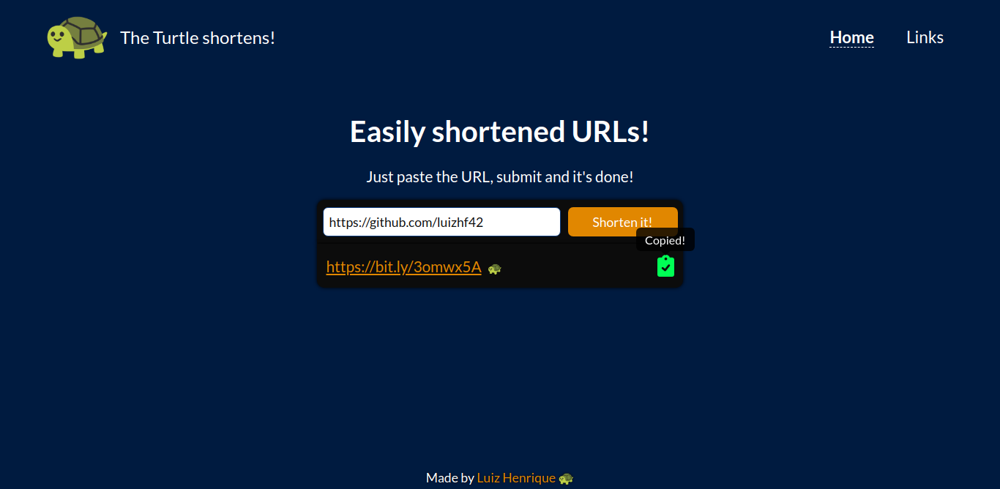
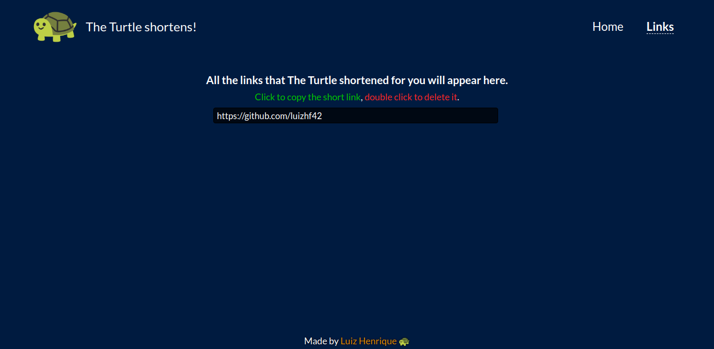

# The Turtle shortens! 

An URL shortener build with Vue.js.

## Table of contents

- [Overview](#overview)
  - [The project](#the-project)
  - [Screenshot](#screenshot)
  - [Links](#links)
- [Process](#process)
  - [Built with](#built-with)
- [Credits](#credits)
- [Author](#author)

## Overview

### The project

An URL shortener with the Bit.ly API. It also haves a /links page, where the previously shortened URLs are shown (stored in the localStorage).

### Screenshot

### Links

- [Live Site URL](https://turtle-shortens.vercel.app/)

## Process

### Built with

- HTML5
- SCSS
- TypeScript
- Axios
- Vue.js
- Vue Router

## Credits

- <a href="https://dev.bitly.com/">Bit.ly API</a>

## Author

- [Luiz Henrique Felix. 🐢](https://www.linkedin.com/in/luiz-henrique-felix)
